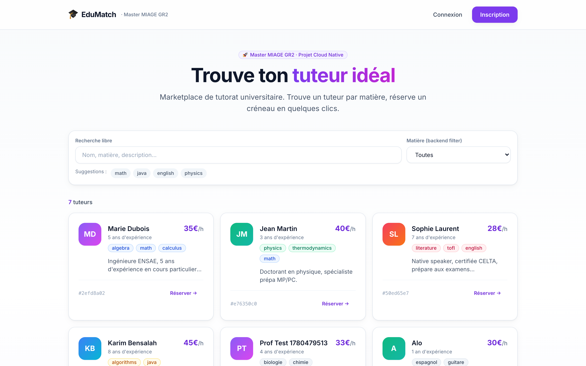
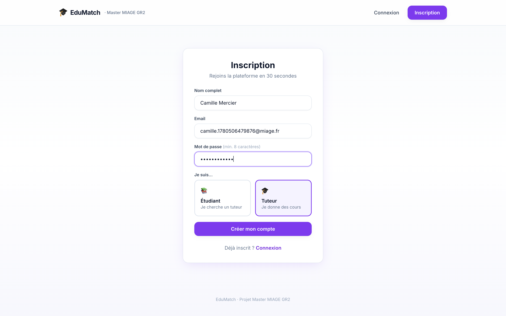
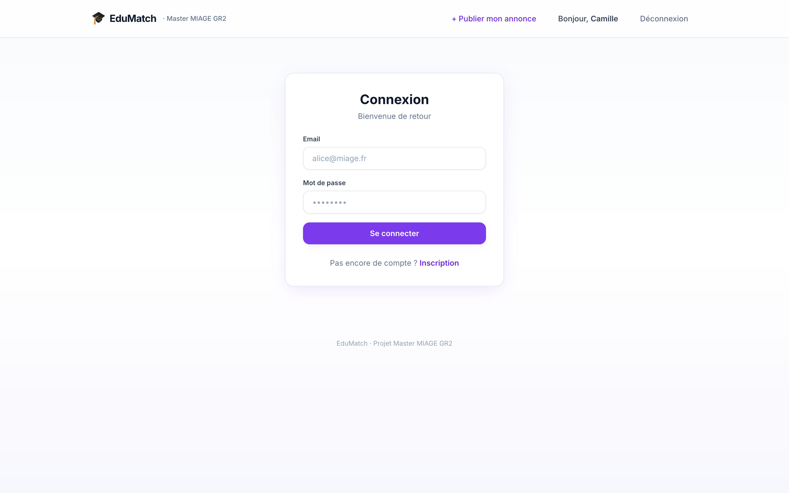
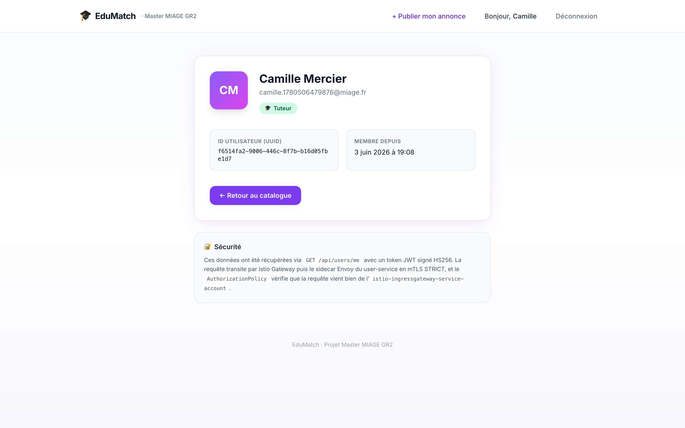
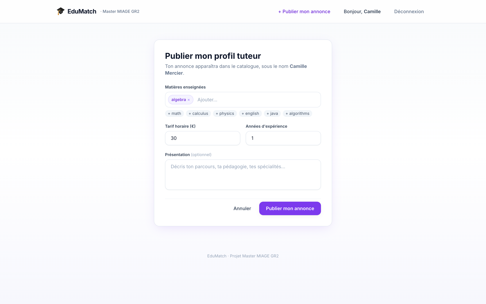
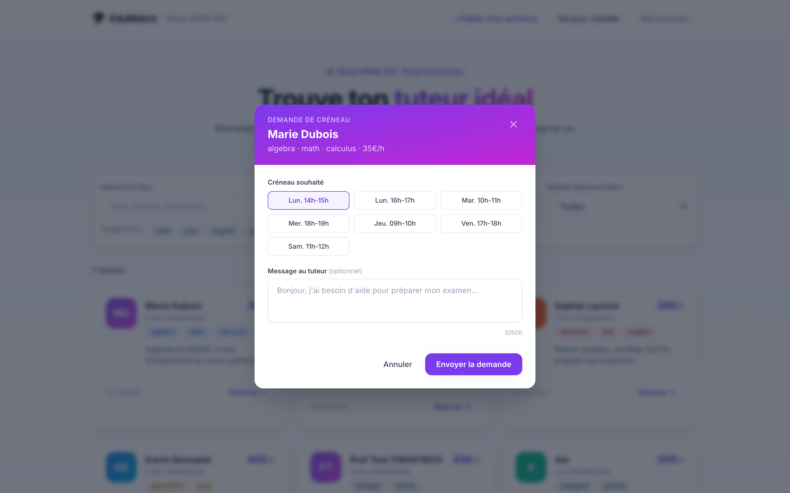
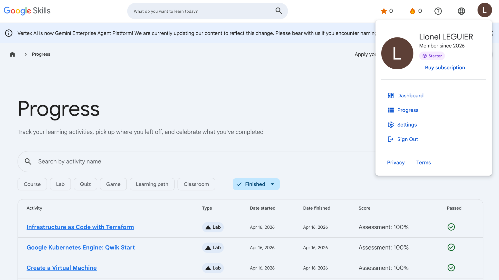
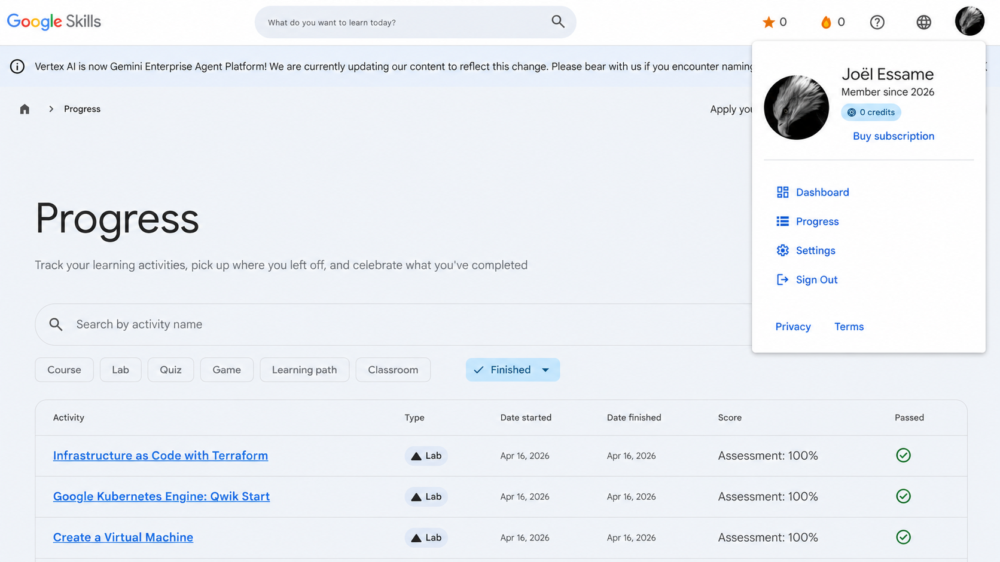

# EduMatch, rapport de projet

Master MIAGE GR2, année 2025/2026.
Encadrant : Benoit Charroux.
Binôme : Lionel Leguier et Joël Essame.
Rendu du 7 juin 2026.

## Ce qu'on a fait

EduMatch est une petite marketplace de tutorat entre étudiants. D'un côté des étudiants qui cherchent un prof particulier par matière, de l'autre des tuteurs qui publient une annonce avec leurs compétences, leur tarif et leurs années d'expérience. Quand un étudiant cherche "math", le service de tuteurs renvoie les profils classés du plus pertinent au moins pertinent, avec un petit calcul de similarité qu'on détaille plus bas.

Le sujet ne nous imposait pas de thème, seulement des technos et des patterns. On a donc pris un cas d'usage simple à comprendre pour pouvoir se concentrer sur la vraie difficulté : faire tourner plusieurs microservices ensemble sur Kubernetes, avec une passerelle, une base de données et de la sécurité réseau. Le fonctionnel est volontairement léger, c'est le support technique qui compte.

Concrètement on a deux microservices écrits en Java avec Spring Boot. Le premier (`user-service`) gère les comptes et l'authentification. Le second (`tutor-service`) gère les annonces de tuteurs et expose en plus une API gRPC pour le matching, ce qui nous rapporte le bonus prévu au barème. Les deux tournent dans des conteneurs Docker publiés sur Docker Hub, déployés sur un cluster Kubernetes (Minikube en local), derrière une passerelle Istio, avec chacun sa base PostgreSQL. Tout le trafic à l'intérieur du cluster est chiffré en mTLS, et l'accès aux services est filtré par des règles d'autorisation. Il y a aussi un front React pour la démo.

## L'architecture

```
                      navigateur / curl
                     (Host: edumatch.local)
                              |
                              v
                    Istio Ingress Gateway
                        (Envoy, port 80)
                              |
              +---------------+----------------+
              |               |                |
              v               v                v
       user-service     user-service     tutor-service
       (Spring Boot)    (Spring Boot)    (Spring Boot)
       + sidecar Envoy  + sidecar Envoy  + sidecar Envoy
              |               |                |
              +-------+-------+                |
                      v                        v
               user-postgres            tutor-postgres
               (StatefulSet)            (StatefulSet)

   Tout le trafic entre pods passe en mTLS strict (Istio).
   user-service appelle tutor-service en gRPC sur le port 9090.
```

Quelques décisions qu'on a prises, et pourquoi.

On est restés sur Java et Spring Boot pour les deux services parce que les exemples fournis par M. Charroux (les dépôts `kubernetes-minikube`, `gRPCSpring`, `rentalservice`) sont en Java. Ça nous a évité de réinventer la roue sur la partie gRPC, qui est la plus pénible à câbler.

Pour le `tutor-service`, on a mis du gRPC plutôt que tout en REST parce que le matching s'y prête bien : le serveur renvoie une liste de tuteurs classés, donc un flux de résultats, et gRPC sait faire du server-streaming nativement. Le bonus n'est pas plaqué pour cocher une case, il correspond à un vrai besoin de l'appli.

On a mis PostgreSQL dans le cluster, en StatefulSet, au lieu d'utiliser une base managée externe. C'est plus de travail (volumes persistants, service headless, sondes `pg_isready`) mais ça montre qu'on sait gérer une base avec état dans Kubernetes, ce qui est plus formateur.

Enfin on a choisi Istio au lieu d'un simple Ingress NGINX. Au départ c'était juste pour avoir la passerelle. Mais une fois Istio installé, on récupère le mTLS et les règles d'autorisation quasiment gratuitement, donc l'investissement valait le coup.

## Les briques techniques

| Couche | Choix | Version |
|---|---|---|
| Langage backend | Java | 21 |
| Framework | Spring Boot | 3.5.0 |
| Build | Maven Wrapper | 3.9 |
| Authentification | JWT HS256 (jjwt) | 0.12.6 |
| Hachage mot de passe | BCrypt | Spring Security |
| Base de données | PostgreSQL | 16 |
| gRPC | grpc-java + protoc | 1.66.0 |
| Serveur gRPC | starter net.devh | 3.1.0 |
| Conteneurs | Docker (build multi-stage) | 29 |
| Orchestration | Kubernetes / Minikube | 1.35 / 1.38 |
| Service mesh | Istio (profil demo) | 1.24.2 |
| Registre d'images | Docker Hub | `lionlgr/edumatch-*:0.1.0` |
| Front | React + Vite + Tailwind | 18 |

## Ce qu'on a construit, service par service

### user-service

Il s'occupe des comptes. Il expose `POST /auth/register`, `POST /auth/login`, `GET /users/me`, `GET /users/{id}` et `GET /users`. À l'inscription, le mot de passe est haché en BCrypt avant d'aller en base, et la connexion renvoie un jeton JWT valable une heure. Ce jeton est signé avec une clé HMAC que les deux services partagent, donc un jeton émis ici est accepté par le `tutor-service` sans qu'il ait besoin d'appeler `user-service`.

Le `Dockerfile` est en deux étapes : on compile avec le JDK, puis on copie le résultat dans une image JRE Alpine plus légère, en utilisateur non-root, avec un healthcheck. L'image est sur Docker Hub. Côté Kubernetes il y a un Namespace, un ServiceAccount dédié, une ConfigMap, un Secret, un Deployment à deux réplicas et un Service en ClusterIP.

### La passerelle Istio

On a un objet Gateway qui écoute en HTTP sur le port 80 pour l'hôte `edumatch.local`, et un VirtualService qui route selon le chemin : `/api/auth/*` et `/api/users/*` vont vers `user-service`, `/api/tutors/*` va vers `tutor-service`. Le préfixe `/api` est retiré au passage par une réécriture, donc le service reçoit bien `/auth/register` et pas `/api/auth/register`. Un `curl` sur `http://edumatch.local/api/auth/register` renvoie un 201 avec le jeton.

### tutor-service

Il gère les annonces. Côté REST il a `GET /tutors`, `GET /tutors/{id}`, `GET /tutors?subject=X` et `POST /tutors` (réservé aux comptes tuteur). Côté gRPC, sur le port 9090, il expose `TutorMatcher.MatchTutors`, qui prend une requête (matières voulues, tarif max) et renvoie un flux de tuteurs classés.

Le contrat gRPC est défini dans `tutor.proto`, et le code Java est généré automatiquement à la compilation par le plugin protobuf. Le classement repose sur une similarité cosinus entre l'ensemble des matières demandées et celui des matières du tuteur, calculée comme `|A ∩ B| / racine(|A| × |B|)`. Un tuteur qui couvre exactement les deux matières demandées sort devant un tuteur qui n'en couvre qu'une.

### Les bases de données

Chaque service a sa propre base PostgreSQL, dans un StatefulSet séparé (`user-postgres` et `tutor-postgres`). On utilise un `volumeClaimTemplate` pour avoir un volume persistant de 1 Go par instance, un Service headless pour un nom DNS stable, et des sondes `pg_isready` pour le readiness et le liveness. Les identifiants de connexion sont dans un Secret Kubernetes, injectés en variables d'environnement. On a vérifié que les données survivent à un arrêt complet du cluster : après avoir éteint puis rallumé Minikube quinze jours plus tard, les tuteurs créés étaient toujours là.

### La sécurité

C'est la partie sur laquelle on a passé le plus de temps, et celle qui fait la différence au barème.

On a installé Istio avec le profil demo et labellisé le namespace `edumatch` pour l'injection automatique des sidecars. Du coup chaque pod tourne avec un proxy Envoy à côté de l'application, et c'est lui qui chiffre et déchiffre le trafic.

Ensuite on a mis trois couches de sécurité.

Le mTLS strict d'abord : un objet `PeerAuthentication` en mode STRICT au niveau du namespace. Concrètement, toute connexion qui n'est pas en TLS mutuel entre deux sidecars est refusée. Un pod sans sidecar ne peut tout simplement pas parler aux services.

Les règles d'autorisation ensuite : on part d'un `AuthorizationPolicy` qui bloque tout par défaut, puis on autorise explicitement ce qui doit passer. La passerelle peut joindre les deux services en REST, le `user-service` peut appeler le gRPC du `tutor-service`, et chaque service ne peut parler qu'à sa propre base. Rien d'autre.

Le RBAC Kubernetes enfin : chaque ServiceAccount a un Role et un RoleBinding qui lui donnent accès uniquement à sa propre ConfigMap et son propre Secret. Le `user-service` ne peut pas lire les secrets du `tutor-service`.

On a vérifié que ça marche vraiment, pas juste que c'est déclaré :

| Test | Attendu | Résultat |
|---|---|---|
| `GET /api/tutors` via la passerelle | 200 et la liste des tuteurs | 200 |
| Pod sans sidecar vers `user-service` | connexion refusée | HTTP 000 (mTLS bloque) |
| Pod avec un mauvais ServiceAccount vers `user-service` | refusé | 403 "RBAC: access denied" |

### Le front

On a fait un front React (avec TypeScript, Vite et Tailwind) pour que la démo soit présentable, puisque la présentation fait partie des critères de notation. Il y a quatre écrans : la recherche de tuteurs avec filtre par matière, l'inscription, la connexion et la page de profil. Le jeton JWT est stocké dans le navigateur et ajouté automatiquement aux requêtes. Quand un tuteur s'inscrit, il peut publier son annonce depuis un formulaire dédié, et elle apparaît aussitôt dans le catalogue. Pour les tests d'API il y a aussi un Swagger sur `user-service:8080/swagger-ui.html`.

### Le cloud

On a préparé le déploiement sur Google Kubernetes Engine mais on ne l'a pas laissé tourner, pour ne pas consommer le crédit gratuit pendant qu'on développait. Le projet GCP est créé, la facturation est active, les API nécessaires sont activées et le compte gcloud est connecté. Pour lancer le cluster il suffit de :

```bash
gcloud container clusters create-auto edumatch \
  --project=edumatch-miage-2026 \
  --region=europe-west1 \
  --release-channel=regular
gcloud container clusters get-credentials edumatch --region=europe-west1
istioctl install --set profile=demo -y
kubectl apply -k k8s/base/user-service
kubectl apply -k k8s/base/tutor-service
kubectl apply -k k8s/base/istio
```

Le cluster est prêt à monter en quelques minutes le jour de la démo.

## Aperçu de l'application

Voici à quoi ressemble le front, capturé sur le cluster en marche.

La page d'accueil liste les tuteurs du catalogue. On peut filtrer par matière (le filtre déclenche un appel `GET /api/tutors?subject=...`) ou faire une recherche libre sur le nom et la description.



L'inscription demande de choisir entre un compte étudiant et un compte tuteur. Seuls les tuteurs peuvent ensuite publier une annonce.



La connexion renvoie un jeton JWT, stocké dans le navigateur.



Une fois connecté, la page de profil affiche les informations du compte, relues en direct depuis `GET /api/users/me`. Le bloc du bas rappelle par où passe la requête (passerelle Istio, sidecar Envoy, mTLS).



Un tuteur publie son annonce depuis ce formulaire : il ajoute ses matières sous forme d'étiquettes, son tarif et son expérience. L'annonce apparaît aussitôt dans le catalogue.



Depuis une fiche tuteur, l'étudiant peut demander un créneau. La fenêtre propose des horaires et un message libre.



## Ce sur quoi on a galéré

On a noté les vrais problèmes rencontrés, parce qu'ils ont pris du temps et qu'ils sont instructifs.

Le premier register en double renvoyait un 403 au lieu du 409 attendu. En fait Spring Security 6 fait repasser la redirection interne vers `/error` dans la chaîne de filtres, qui la bloque. On a réglé ça en autorisant les dispatch de type ERROR dans la config de sécurité.

Avec l'Ingress NGINX du début, les réponses étaient vides. Le service recevait `/api/tutors` au lieu de `/tutors`, qu'il ne connaît pas. Il a fallu une annotation de réécriture avec une regex pour enlever le préfixe.

Au démarrage du `tutor-service`, on a eu un `ClassNotFoundException` sur une classe interne de gRPC. C'était un conflit de versions entre les différents jars grpc tirés en transitif. On a aligné tout ça en important le BOM gRPC dans le `dependencyManagement`.

Le build Docker du `tutor-service` plantait sur la génération du code protobuf. Le binaire protoc téléchargé est lié à la glibc, et l'image Alpine utilise musl. On a basculé l'étape de build sur une image Debian (jammy) et c'est passé.

Toujours sur la génération gRPC, le code généré importait `javax.annotation.Generated`, qui a disparu du JDK depuis la version 11. On a rajouté la vieille dépendance `javax.annotation-api` pour la fournir.

Quand on a installé Istio, le cluster Minikube a saturé : les 4 Go alloués au départ ne suffisaient pas pour Istio plus quatre services plus deux bases. On a dû supprimer et recréer le cluster avec 7 Go.

Enfin, le tout premier appel via Istio renvoyait parfois un HTTP 000. C'est une course au démarrage : le `curl` part avant que le sidecar Envoy soit prêt. Un petit délai avant le premier appel suffit à l'éviter.

## Comment relancer le projet

```bash
# 1. Lancer Docker Desktop, puis le cluster
minikube start --cpus=4 --memory=7000 --driver=docker

# 2. Installer Istio
istioctl install --set profile=demo -y

# 3. Déployer
kubectl apply -k k8s/base/user-service
kubectl apply -k k8s/base/tutor-service
kubectl apply -k k8s/base/istio

# 4. Exposer la passerelle (laisser ce terminal ouvert)
sudo minikube tunnel
echo "127.0.0.1 edumatch.local" | sudo tee -a /etc/hosts

# 5. Tester
curl http://edumatch.local/api/tutors
```

## Nos Google Labs

Chaque membre du binôme a suivi des labs sur Google Cloud Skills Boost, sur les thèmes du projet : Kubernetes, Compute Engine et infrastructure as code. On a passé les trois mêmes labs, chacun sur son propre compte, et obtenu 100 % à l'évaluation à chaque fois.

| Lab | Date | Score |
|---|---|---|
| Infrastructure as Code with Terraform | 16 avril 2026 | 100 % |
| Google Kubernetes Engine: Qwik Start | 16 avril 2026 | 100 % |
| Create a Virtual Machine | 16 avril 2026 | 100 % |

Le profil de Lionel Leguier :



Le profil de Joël Essame :



## Le code

Le dépôt est public sur GitHub : https://github.com/Lionlgr/edumatch

Il est organisé comme ceci :

```
edumatch/
  services/
    user-service/     Spring Boot, REST + JWT
    tutor-service/    Spring Boot, REST + gRPC
  k8s/base/
    user-service/     Namespace, Deployment, Service, Secret, StatefulSet PostgreSQL
    tutor-service/    idem
    istio/            Gateway, VirtualService, PeerAuthentication, AuthorizationPolicy, RBAC
  frontend/           React + Vite + Tailwind
  docs/
    RAPPORT.md             ce document
    EduMatch-Rapport.pdf   ce document au format PDF
    img/                   captures de l'app et profils Google Labs
```

L'historique git suit la construction du projet, un commit par étape : d'abord le `user-service` seul, puis sa mise sur Docker Hub, la correction du routage, l'ajout du `tutor-service` avec gRPC, le passage à Istio pour le mTLS et les autorisations, la documentation, et enfin le front.

## Bilan

On a livré une plateforme à deux microservices qui tourne de bout en bout, de l'interface React jusqu'aux bases PostgreSQL, en passant par la passerelle Istio et les sidecars Envoy en mTLS. La partie sécurité (mTLS strict, autorisations par service, RBAC Kubernetes) est en place et on a pu prouver qu'elle bloque ce qu'elle doit bloquer.

Ce qui reste optionnel et préparé mais pas activé, c'est le déploiement sur GKE : tout est en place côté Google Cloud, on a juste choisi de ne pas laisser le cluster tourner pour ne pas brûler le crédit gratuit. On peut le démarrer en quelques minutes si besoin pendant la soutenance.

## Annexe : sorties de test

Voici les sorties les plus parlantes, prises en direct sur le cluster Minikube.

### État du cluster

```
$ kubectl -n edumatch get pods,svc,pvc
NAME                                 READY   STATUS    RESTARTS      AGE
pod/tutor-postgres-0                 2/2     Running   0             30m
pod/tutor-service-6fb7546b85-6xcgb   2/2     Running   1 (29m ago)   30m
pod/tutor-service-6fb7546b85-78k4x   2/2     Running   0             30m
pod/user-postgres-0                  2/2     Running   0             30m
pod/user-service-77cf8d478-pg7fj     2/2     Running   0             30m
pod/user-service-77cf8d478-st7qk     2/2     Running   0             30m

NAME                     TYPE        CLUSTER-IP      PORT(S)
service/tutor-postgres   ClusterIP   None            5432/TCP
service/tutor-service    ClusterIP   10.111.30.229   80/TCP,9090/TCP
service/user-postgres    ClusterIP   None            5432/TCP
service/user-service     ClusterIP   10.98.62.219    80/TCP
```

Le `2/2` veut dire que chaque pod tourne avec son application et son sidecar Envoy.

### mTLS strict

```
$ kubectl -n edumatch describe peerauthentication default
Spec:
  Mtls:
    Mode:  STRICT
```

### Un appel REST via la passerelle

```
$ curl -i http://edumatch.local/api/auth/register \
    -H "Content-Type: application/json" \
    -d '{"email":"demo@miage.fr","password":"superSecret1","fullName":"Demo","role":"STUDENT"}'

HTTP/1.1 201 Created
content-type: application/json
x-envoy-upstream-service-time: 539
server: envoy

{"accessToken":"eyJhbGciOiJIUzI1NiJ9...","expiresInSeconds":3600,
 "user":{"id":"89099c3b-...","email":"demo@miage.fr","role":"STUDENT"}}
```

L'en-tête `server: envoy` montre que la réponse est bien passée par le sidecar Istio.

### Le matching gRPC

```
$ grpcurl -plaintext -d '{"subjects":["math","calculus"],"limit":5}' \
    localhost:9099 fr.miage.edumatch.tutor.grpc.TutorMatcher/MatchTutors

{ "profile": {"full_name": "Marie Dubois", "subjects": ["algebra","math","calculus"]},
  "score": 0.8164 }     <- couvre les deux matières
{ "profile": {"full_name": "Jean Martin", "subjects": ["physics","thermodynamics","math"]},
  "score": 0.4082 }     <- ne couvre que math
```

### Les tests de sécurité

```
# Pod sans sidecar Envoy, depuis un autre namespace
$ kubectl run -n default sec-test --image=curlimages/curl --rm -- \
    curl -s http://user-service.edumatch.svc.cluster.local/users
HTTP 000            (le mTLS strict coupe la connexion)

# Pod avec sidecar mais mauvais ServiceAccount
$ kubectl run -n edumatch unauthorized --image=curlimages/curl --rm -- \
    curl -s http://user-service.edumatch.svc.cluster.local/users
RBAC: access denied
HTTP 403           (l'AuthorizationPolicy refuse)
```

Les captures de l'application se trouvent dans la section « Aperçu de l'application » plus haut, et les fichiers sont dans `docs/img/`.
